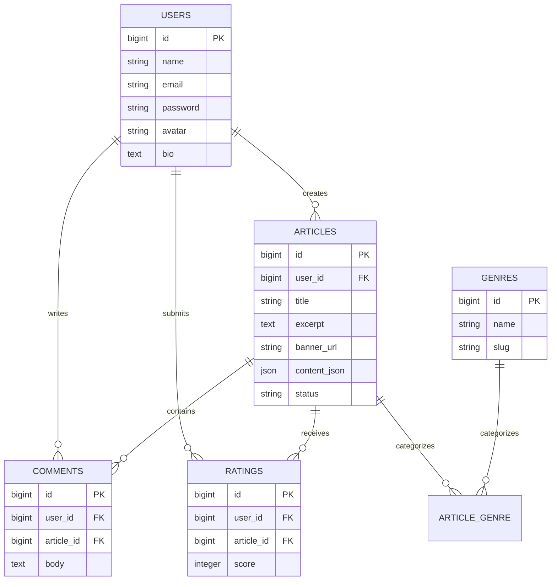
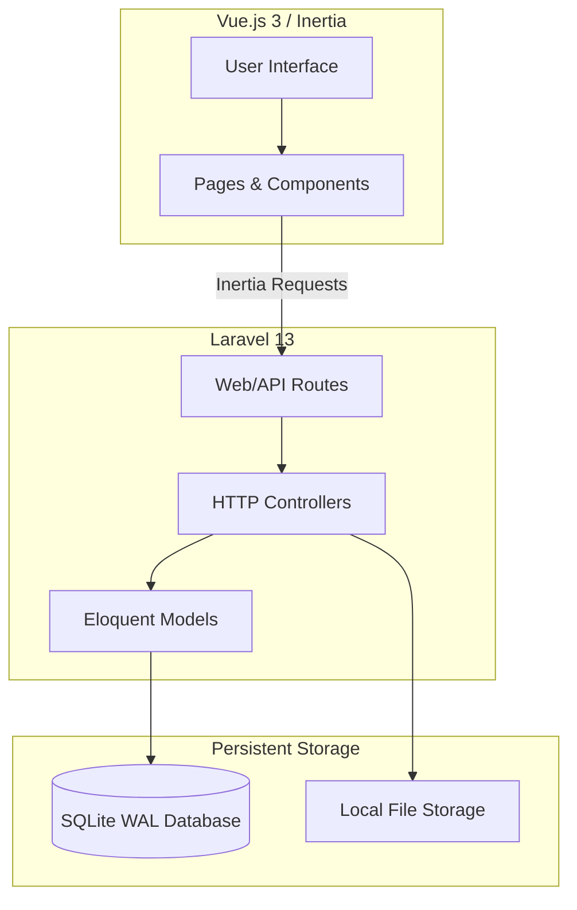
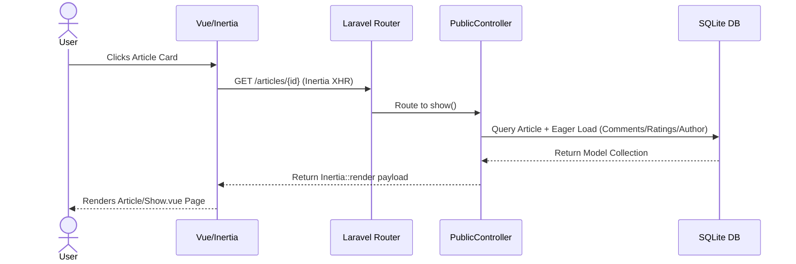
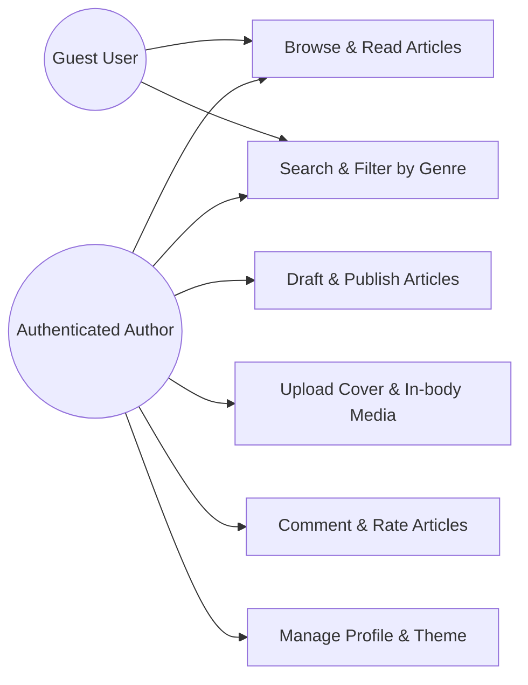
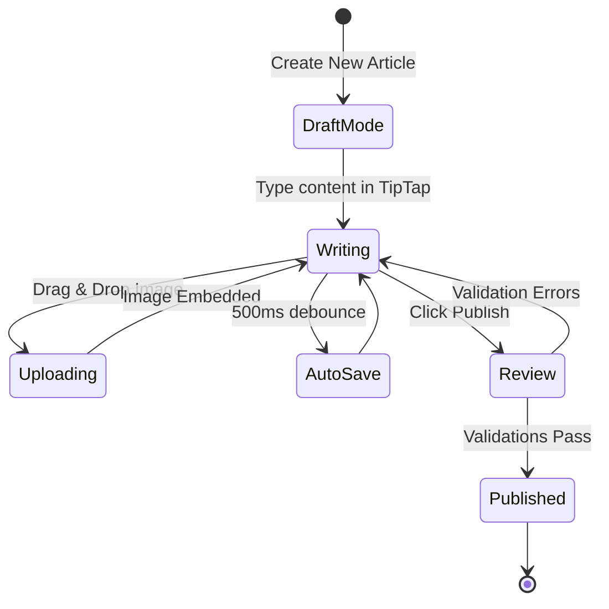
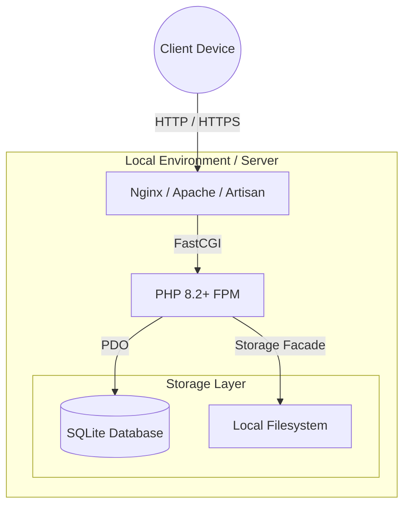
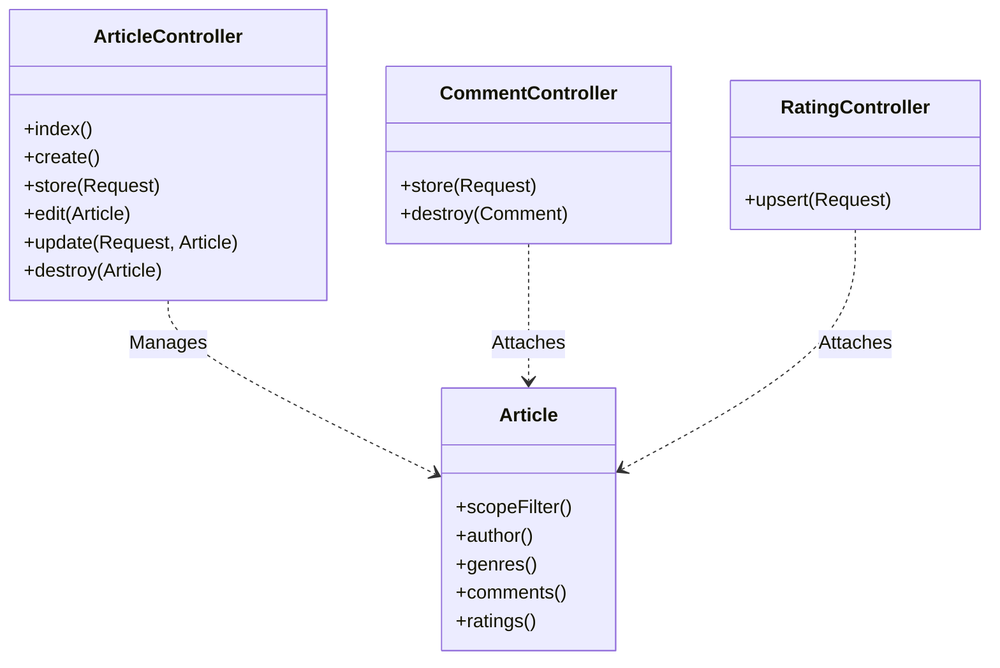

<p align="center">
  
</p>

<h1 align="center">MindScribe</h1>

<p align="center">
  <strong>A premium, dynamic content authoring and discovery platform.</strong><br>
  Built with Laravel 13, Vue.js 3 (Inertia), Tailwind CSS, and TipTap.
</p>

<p align="center">
  
  
  
  
</p>

---

## 📋 Table of Contents
1. [About the Project](#-about-the-project)
2. [Deep Dive: Features & Architecture](#-deep-dive-features--architecture)
3. [Tech Stack](#️-tech-stack)
4. [Agile Scrum Methodology](#-agile-scrum-methodology)
5. [Git Workflow Guide](#-git-workflow-guide)
6. [Local Development Setup](#️-local-development-setup)
7. [License](#-license)

---

## 📖 About the Project

**MindScribe** is designed to provide authors with an incredibly intuitive, distraction-free environment to write and publish articles, while offering readers a stunning, dynamic discovery feed to explore content. 

This project goes beyond a simple CRUD application by incorporating advanced rich-text parsing, real-time reactive user interfaces using Inertia.js, and a beautifully optimized SQLite-WAL backend that guarantees low-latency reads.

---

## 🔍 Deep Dive: Features & Architecture

### 1. Robust Content Authoring (TipTap Engine)
At the core of MindScribe is a heavily customized **TipTap headless editor**.
- **Block Architecture:** Text, headings, blockquotes, and images are strictly structured.
- **In-body Media:** Images can be seamlessly uploaded asynchronously and embedded directly within the article draft.
- **JSON Payload Validation:** Content is stored as validated JSON blocks in the database, allowing us to parse and render it securely on the frontend without relying on dangerous raw HTML injection.

### 2. Discovery Feed & Photocards
The main interface features a premium grid layout.
- **Dynamic Photocards:** Articles are rendered as interactive cards with fallback gradient banners using the article's title initials.
- **Eager-Loaded Aggregates:** The backend pipeline utilizes Laravel's `withCount` and `withAvg` methods to calculate comment totals and star ratings in real-time.

### 3. Advanced Filtering & Search
A dedicated local scope pipeline queries the database.
- Uses `whereHas` relational mapping to filter articles strictly by attached **Genre Tags**.
- Implements `LIKE` query parameters bound securely through Laravel to search titles and excerpts.

---

## 📊 Architecture & Diagrams

<details>
<summary><strong>1. Entity-Relationship (ER) Diagram</strong></summary>


</details>

<details>
<summary><strong>2. Component Architecture Diagram</strong></summary>


</details>

<details>
<summary><strong>3. Sequence Diagram (Article Fetching)</strong></summary>


</details>

<details>
<summary><strong>4. Use-Case Diagram</strong></summary>


</details>

<details>
<summary><strong>5. Activity Diagram (Article Publishing Flow)</strong></summary>


</details>

<details>
<summary><strong>6. Deployment & Infrastructure Diagram</strong></summary>


</details>

<details>
<summary><strong>7. Package / Class Diagram</strong></summary>


</details>

<details>
<summary><strong>8. Function / Collaboration Diagram (Store Article)</strong></summary>

```mermaid
flowchart LR
    A[ArticleController@store] --> B{Validate Request}
    B -- Valid --> C[Extract TipTap JSON]
    B -- Invalid --> X[Return Errors]
    C --> D[Handle Image Uploads]
    D --> E[Save to Local Storage]
    E --> F[Create Article Record]
    F --> G[Attach Genre IDs]
    G --> H[Redirect to Dashboard]
```
</details>

---

## 🛠️ Tech Stack

- **Backend:** [Laravel 13](https://laravel.com/) (PHP) for robust routing, Eloquent ORM, and secure API delivery.
- **Frontend:** [Vue.js 3](https://vuejs.org/) (Composition API) integrated with [Inertia.js](https://inertiajs.com/) for a classic monolith feel without building a separate SPA API.
- **Styling:** [Tailwind CSS 3](https://tailwindcss.com/) mapped with a custom design system focusing on glassmorphism and deep dark-mode support.
- **Editor:** [TipTap](https://tiptap.dev/) (ProseMirror-based).
- **Database:** SQLite running in **WAL (Write-Ahead Logging)** mode to eliminate database lock contention in a local environment.

---

## 🏃 Agile Scrum Methodology

MindScribe is strictly managed using an Agile Scrum framework. The project's full roadmap, User Stories, and Sprint Planning are meticulously tracked.

📄 **View the official Scrum Board Documentation:**  
[`Agile_Scrum_Project_MindScribe.xlsx`](Agile_Scrum_Project_MindScribe.xlsx)

### Sprint Structure
The project is broken into structured, two-week Sprints:
- **Sprint 1:** Core Authentication (Registration/Login) & Basic User Profile Management.
- **Sprint 2:** Advanced Content Authoring (Editor workspace, TipTap engine, Media Uploads).
- **Sprint 3:** Content Discovery (Author profiles, Genre Tagging, Dynamic Search, Premium Reader Layout).
- **Sprint 4:** Interactive Engine (Comments & Star Rating System).

Each User Story has a dedicated `MS-[ID]` (e.g., `MS-4`, `MS-16`) that MUST be tracked using Jira Smart Commits.

---

## 🌿 Git Workflow Guide

We strictly adhere to a Feature Branch Workflow. **Do not commit directly to the `main` branch.**

Repository URL: `https://github.com/AbirHasanArko/MindScribe` (or `mindscribe-legacy`)

### 1. Pull the Latest Changes
Always start by ensuring your local `main` branch is up to date:
```bash
git checkout main
git pull origin main
```

### 2. Create a Feature Branch
Create a branch using the exact Jira Issue ID and a short descriptor:
```bash
git checkout -b feature/MS-5-session-fix
```

### 3. Stage ONLY Necessary Files
Avoid using `git add .` as it can stage unintended configuration files. Explicitly target the files you worked on:
```bash
git add app/Http/Controllers/Auth/AuthenticatedSessionController.php routes/auth.php
```

### 4. Write a Jira Smart Commit
Your commit message must begin with the Issue ID and an imperative verb. Use a multi-line commit to explain the details. Append `#done` if the task is complete.
```bash
git commit -m "MS-5: configure User Login authentication logic #done

- Handled secure login sessions using Laravel Breeze
- Added rate limiting to prevent brute force attacks"
```

### 5. Push Your Branch
Push your newly created feature branch to the remote repository:
```bash
git push -u origin feature/MS-5-session-fix
```

### 6. Create a Pull Request (PR)
Go to GitHub and open a PR from `feature/MS-5-session-fix` to `main`. Once QA and the Scrum Master approve, it will be merged!

*(For a massive cheat sheet covering the exact git commands for every role and task in this project, see [`git_commands_by_role.md`](git_commands_by_role.md))*

---

## ⚙️ Local Development Setup

### Prerequisites
- PHP 8.2+
- Composer
- Node.js (v18+) & NPM

### Installation

1. **Clone the repository:**
   ```bash
   git clone https://github.com/AbirHasanArko/mindscribe-legacy.git
   cd mindscribe-legacy
   ```

2. **Install Dependencies:**
   ```bash
   composer install
   npm install
   ```

3. **Environment Setup:**
   ```bash
   cp .env.example .env
   php artisan key:generate
   ```

4. **Storage Link:**
   Ensure public disk files are accessible:
   ```bash
   php artisan storage:link
   ```

5. **Database Migration & Seeding:**
   ```bash
   php artisan migrate --seed
   ```

6. **Compile Frontend & Start Server:**
   ```bash
   npm run dev
   php artisan serve
   ```
   Visit `http://localhost:8000` in your browser.

---

## 📜 License

MindScribe is open-sourced software licensed under the [MIT license](https://opensource.org/licenses/MIT).
